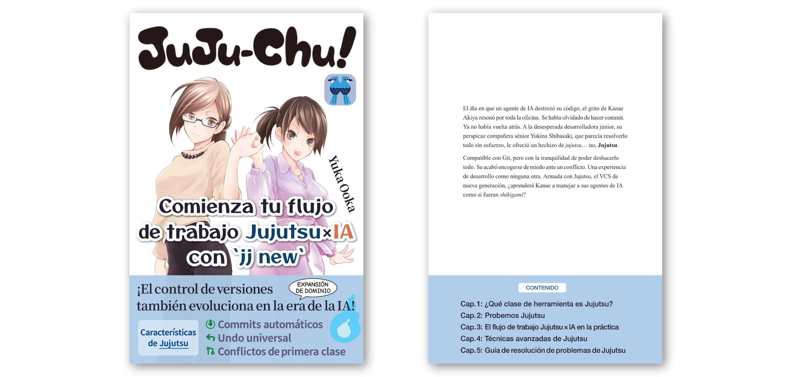

# Repositorio complementario de _Juju-chu! Comienza tu flujo de trabajo Jujutsu × IA con `jj new`_

Este repositorio contiene el código de ejemplo de _Juju-chu! Comienza tu flujo de trabajo Jujutsu × IA con `jj new`_, además de las erratas y la información sobre actualizaciones.

 

## ■ Descripción general

_Juju-chu! Comienza tu flujo de trabajo Jujutsu × IA con `jj new`_ es una guía completa para iniciarse en **[Jujutsu](https://www.jj-vcs.dev/)**, un sistema de control de versiones de nueva generación que cada vez despierta más interés.

El libro explica los fundamentos y ayuda a construir un modelo mental de Jujutsu mediante comparaciones con Git. También ofrece consejos prácticos para trabajar con agentes de programación y soluciones a los problemas más frecuentes al usar Jujutsu en proyectos reales.

Al terminarlo, podrás empezar a usar Jujutsu de inmediato e incorporarlo a tu trabajo diario de desarrollo asistido por IA.

 

## ■ Muestra gratuita

Hay una muestra gratuita disponible en PDF y EPUB. Puedes echarle un vistazo antes de leer el libro completo.

- [Muestra gratuita en PDF](./jujuchu-sample.pdf)
- [Muestra gratuita en EPUB](./jujuchu-sample.epub)

 

## ■ Dónde comprarlo

### Leanpub

- [Edición en PDF y EPUB](https://leanpub.com/juju-chu-es) (desde 12 USD)

### Amazon

- [Edición Kindle](https://www.amazon.com/dp/B0HHYY8RMD) (12 USD)
- [Edición en tapa blanda](https://www.amazon.com/dp/B0H82KN1BH) (18,50 USD)

 

## ■ Código de ejemplo

El código fuente de los ejemplos de configuración que aparecen en el libro está disponible en los siguientes directorios:

- Ejemplos de configuración del capítulo 3: [`./samples/ch3/`](./samples/ch3/)
- Ejemplos de configuración del capítulo 4: [`./samples/ch4/`](./samples/ch4/)

 

## ■ Erratas y actualizaciones

La edición digital se actualiza cuando hace falta. Si la compraste, descarga la versión más reciente desde la misma tienda.

Para saber qué erratas y actualizaciones corresponden a tu edición impresa, comprueba los datos de impresión que aparecen en el colofón de tu ejemplar y consulta la página siguiente.

- [Erratas y actualizaciones](./errata.md)

 

## ■ Tabla de contenido

#### Prefacio

#### Sobre este libro

#### Prólogo

#### Capítulo 1. ¿Qué clase de herramienta es Jujutsu?

- 1-1. ¿Encaja mal Git con el agentic coding?
- 1-2. Las características de Jujutsu que destacan en la era de la IA
- Columna: cómo Git revolucionó el control de versiones

#### Capítulo 2. Probemos Jujutsu

- 2-1. Configurar Jujutsu
  - 2-1-1. Instalar Jujutsu
  - 2-1-2. Configuración inicial
- 2-2. Un recorrido práctico por Jujutsu
  - 2-2-1. Inicializar un repositorio
  - 2-2-2. Comprobar el estado del repositorio
  - 2-2-3. Trabajar con los changes
  - 2-2-4. Interactuar con un remoto
- 2-3. Los tres tipos de log de Jujutsu
  - 2-3-1. El log de revisiones (`jj log`)
  - 2-3-2. El evolution log (`jj evolog`)
  - 2-3-3. El operation log (`jj operation log`)
- 2-4. El modelo mental de Jujutsu
  - 2-4-1. ¿Qué es un change?
  - 2-4-2. La diferencia entre branch y bookmark
  - 2-4-3. Trabajar en branches anónimos
- 2-5. Comandos `jj` de uso frecuente
- Columna: las raíces de Jujutsu — ¿qué clase de VCS es Mercurial?

#### Capítulo 3. El flujo de trabajo Jujutsu × IA en la práctica

- 3-1. Coordinar los agentes de IA con Jujutsu
  - 3-1-1. Conseguir que los agentes de IA usen Jujutsu
  - 3-1-2. Configuración de Permissions para los comandos `jj`
  - 3-1-3. Ejecutar `jj fix` mediante Hooks
- 3-2. Un recorrido por el proceso de desarrollo Jujutsu × IA
  - 3-2-1. Ajustar la granularidad de los changes creados por la IA
  - 3-2-2. Hacer push y crear un PR
  - 3-2-3. Desarrollo en paralelo con workspaces
- Columna: las herramientas que dieron forma a Jujutsu, parte 1

#### Capítulo 4. Técnicas avanzadas de Jujutsu

- 4-1. Formas ingeniosas de especificar tus objetivos
  - 4-1-1. Especificar revisiones con astucia usando revsets
  - 4-1-2. Especificar archivos con astucia usando filesets
- 4-2. Comandos prácticos de usuario avanzado que conviene conocer
  - 4-2-1. `jj absorb`
  - 4-2-2. `jj arrange`
  - 4-2-3. `jj bookmark advance`
- 4-3. Tácticas alternativas para los Git hooks
- 4-4. Resolver conflictos de forma semiautomática
  - 4-4-1. Mergiraf
  - 4-4-2. Weave
- 4-5. Herramientas de UI para Jujutsu
  - 4-5-1. jjui
  - 4-5-2. JJ View
- Columna: las herramientas que dieron forma a Jujutsu, parte 2

#### Capítulo 5. Guía de resolución de problemas de Jujutsu

- 5-1. FAQ
  - 5-1-1. Comparación con Git
    - ¿Qué puede hacer Git que Jujutsu no?
    - ¿No hay comando `merge`?
    - ¿No hay comando `pull`?
    - Quiero hacer el equivalente al cherry-pick de Git
  - 5-1-2. Operaciones y ajustes de nicho
    - ¿Puedo comprobar el contenido de un archivo en un punto dado sin mover `@`
    - Quiero dividir un change cronológicamente
    - No quiero logs ni volcados temporales en mi historial
    - Quiero guardar la configuración de Jujutsu de un repositorio en el propio repositorio
    - Quiero renombrar un bookmark en tracking
  - 5-1-3. Curiosidades sobre Jujutsu
    - ¿Es Jujutsu un wrapper de Git?
    - ¿Qué clase de persona creó Jujutsu?
    - ¿Qué significa el nombre Jujutsu y cómo se pronuncia?
- 5-2. Resolución de problemas
  - Un push normal se convierte silenciosamente en un force push
  - Aparece un críptico «Error: The working copy is stale»
  - Un change se ha quedado con una anotación «divergent» sin saber cómo
  - Jujutsu no rastrea mis archivos de imagen o video
  - Después de hacer merge de un PR y un fetch, `@` se va por donde no debe
  - Borré de GitHub un bookmark remoto en el que aún estaba trabajando
  - Claude Code me pide permiso para ejecutar `jj log` aunque está en allow
- Columna: ¡Queremos un servicio de hosting nativo de JJ!

#### Epílogo

---

© 2026 Yuka Ooka / [Klemiwary Books](https://klemiwary.com/)
